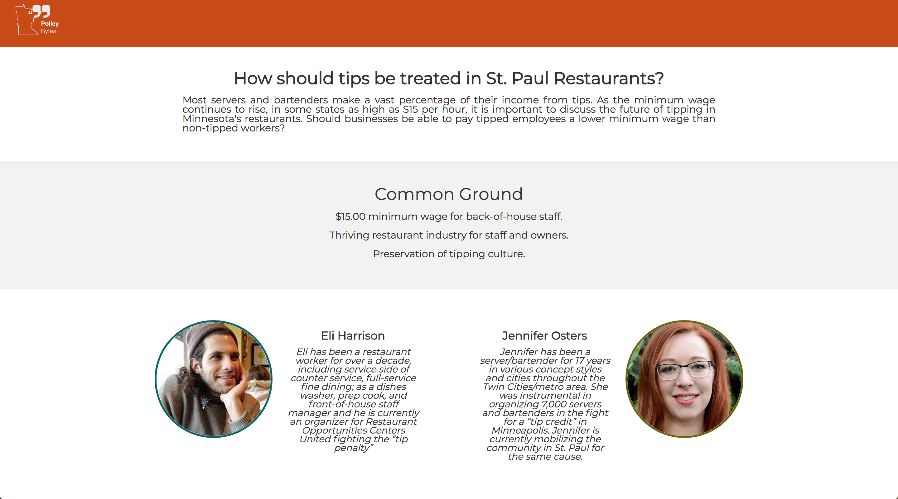
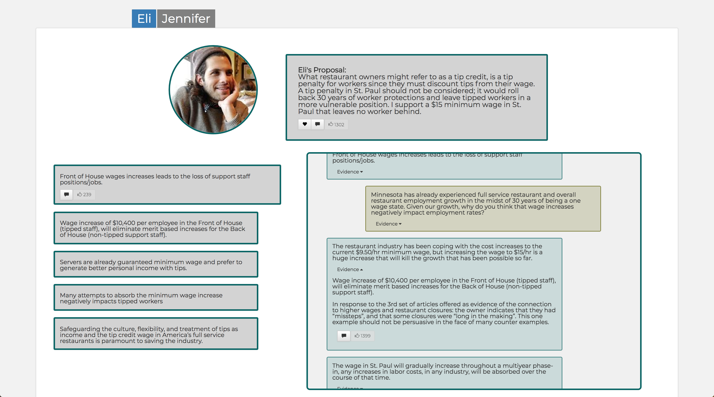

# Policy Bytes

Policy Bytes is a full-stack webapp designed for Citizens Leauge, a nonpartisan nonprofit based in St. Paul, MN. Citizens Leauge works to ensure Minnesotans of all backgrounds and ideologies have the opportunity to be engaged, inspired and empowered to take an active role in public policymaking. Policy Bytes is designed to host civil, accessiable, and accountable conversations between experts about critical topics in public policy, from tax reform to tip credits. The site features a threaded comment section to allow users to participate in the conversation as well. 

 
 

### Built With: 
- React.js & React-Redux
- Node.js
- PostgreSQL
- React-Bootstrap
- Font Awesome
- Passport (Local and Facebook Authorizatoin)
- Filestack
- Express

### Getting Started: 

Required: 
- [Node.js](https://nodejs.org/en/)
- [PostrgeSQL](https://www.postgresql.org/)
- [Nodemon](https://nodemon.io/)

To start with a sample table:  
- Create a new database in PostgreSQL named `policy-bytes-2`
- In terminal, navigate to the folder containing sampleData.psql (at the root of this project)
- run command `psql policy_bytes_2 < dbexport.psql`. This should give you a starting database. 
- Default admin login, accessible by going to /admin in the URL bar, username: david password: 12

To run a development build on your own machine: 

1) Clone/download Repository
2) `npm install`

3) Create a .env file with the following variables, for local deployment set DEV=true;

SERVER_SESSION_SECRET= 
FACEBOOK_APP_ID= 
FACEBOOK_APP_SECRET= 
DEV=true
LOCALHOST_REDIRECT_URL=YOUR_LOCALHOST_AND_PORT/api/facebook/callback
DEPLOY_REDIRECT_URL=YOUR_DEPLOY_URL/api/facebook/callback
LOCALHOST_SUCCESS_URL=YOUR_LOCALHOST_AND_PORT/#/topicPage
DEPLOY_SUCCESS_URL=YOUR_DEPLOY_URL/#/topicPage

To get a FACEBOOK_APP_ID and FACEBOOK_APP SECRET, register a new PolicyBytes app at https://developers.facebook.com/. Also list the site's domain, as well as redirect URLs.

If you are in development, in FacebookLogin.jsx, change the URL for the callback manually to localhost:
https://localhost:3000/api/facebook/send

Otherwise change it to the name of your deployed site plus /api/facebook/send.

4) Get a key and cert for https development with create-react-app. More info here: https://medium.com/@nileshsingh/everything-about-creating-an-https-server-using-node-js-2fc5c48a8d4e

5) For local development, in Server.js at the bottom comment out the lines for var options, var server and server.listen, and comment in app.listen.

6) `npm run server`
7) `npm run client` 

### Features: 
- Dynamic landing page with an introduction to the site's format, an admin-selectable 'Current Conversation', and an archive section. 
- Topic Page featuring the topic premise, contributors' bios and common ground, and an intuitive discussion platform highlighting the contributors' key points and the back-and-forth conversation between contributors on each key point. 
- A threaded comments section with likes and replies.
- The ability to engage further with relevent non-profits by clicking 'Love' on a contributor's premise or key claim. 
- A robust admin section allowing the user to create/edit/delete, publish/unpublish, and feature/unfeature, topics. 
- A Facebook authorization strategy encouragins users to engage in a civil, respectful manner in the comments section.

## Next Steps: 
- Ability to add/delete key claims and stream items when editing topics. 
- Color code admin's Create Topic view to make it more user friendly. 
- Mobile-friendly styling. 

#### Hand-crafted by: Justin Peterson, David Kesler, Kerry Burns, and Atticus Pomerantz